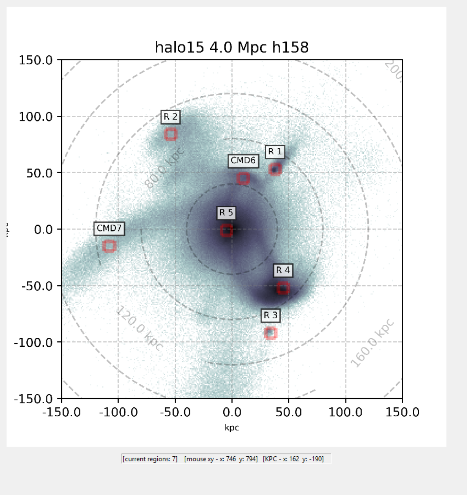
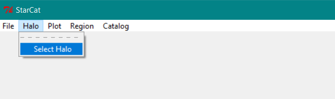

# Welcome to Starcat
Make stellar catalogs from simulated halos.

 
# Getting started
## 1. Clone this repo onto your local machine.

        
        
    git clone https://github.com/swc2124/starcat.git

## 2. Enter into the directory starcat/starcat
    
    cd starcat/starcat

## 3. Run "python starcat_gui.py"
    
    python starcat_gui.py

## 4. From the top menu select Halo>Select Halo.

## 5. Select a halo grid file.

## 6. From the top menu select Plot>Set Units to set plot units & Replot.

## 7. You can alo select the detector from Menu>Region>Detectors.

## 8. Over the halo plot, right-click and select region:

## 10. Example output
     
     catalogs/
        |
        ├── halo08/                         <-- each halo's output directory
        |     |
        │     ├── halo08.png                <-- main plot with regions marked
        │     ├── halo08_cb.png             <-- color bar
        │     ├── R 1.fits                  <-- fits table for region
        │     ├── R 2.fits
        │     ├── R 3.fits
        │     └── recordtable.txt           <-- txt table with basic stats
        |
        ├── halo10/
        |     |
        │     ├── halo10.png
        │     ├── halo10_cb.png
        │     ├── R 1.fits
        │     ├── R 2.fits
        │     ├── R 3.fits
        │     └── recordtable.txt
        |
        └── halo17/
              |
              ├── halo17.png
              ├── halo17_cb.png
              ├── R 1.fits
              ├── R 2.fits
              ├── R 3.fits
              └── recordtable.txt

## Complete file system
    
     starcat
        ├── .gitignore
        ├── .pypirc
        ├── data
        │   ├── catalogs
        │   │   └── Julianne
        │   │       └── Halo08_catalogs
        │   │           ├── halo08_cmd.png
        │   │           ├── halo08_ebf_and_dat_regions.png
        │   │           ├── halo08_Region_1.fits
        │   │           ├── halo08_Region_2.fits
        │   │           ├── halo08_Region_3.fits
        │   │           ├── halo08_Region_4.fits
        │   │           └── halo08_Region_info.txt
        │   ├── grids
        │   │   ├── halo02_4.0Mpc_h158_grid.npy
        │   │   ├── halo05_4.0Mpc_h158_grid.npy
        │   │   ├── halo08_4.0Mpc_h158_grid.npy
        │   │   ├── halo09_4.0Mpc_h158_grid.npy
        │   │   ├── halo10_4.0Mpc_h158_grid.npy
        │   │   ├── halo12_4.0Mpc_h158_grid.npy
        │   │   ├── halo14_4.0Mpc_h158_grid.npy
        │   │   ├── halo15_4.0Mpc_h158_grid.npy
        │   │   ├── halo17_4.0Mpc_h158_grid.npy
        │   │   └── halo20_4.0Mpc_h158_grid.npy
        │   ├── plots
        │   ├── saved
        │   └── tables
        │       ├── halo02_4.0Mpc_CMD_table.hdf5
        │       ├── halo02_4.0Mpc_h158_table.hdf5
        │       ├── halo02_4.0Mpc_pxpy_table.hdf5
        │       ├── halo05_4.0Mpc_CMD_table.hdf5
        │       ├── halo05_4.0Mpc_h158_table.hdf5
        │       ├── halo05_4.0Mpc_pxpy_table.hdf5
        │       ├── halo08_4.0Mpc_CMD_table.hdf5
        │       ├── halo08_4.0Mpc_h158_table.hdf5
        │       ├── halo08_4.0Mpc_pxpy_table.hdf5
        │       ├── halo09_4.0Mpc_CMD_table.hdf5
        │       ├── halo09_4.0Mpc_h158_table.hdf5
        │       ├── halo09_4.0Mpc_pxpy_table.hdf5
        │       ├── halo10_4.0Mpc_CMD_table.hdf5
        │       ├── halo10_4.0Mpc_h158_table.hdf5
        │       ├── halo10_4.0Mpc_pxpy_table.hdf5
        │       ├── halo12_4.0Mpc_CMD_table.hdf5
        │       ├── halo12_4.0Mpc_h158_table.hdf5
        │       ├── halo12_4.0Mpc_pxpy_table.hdf5
        │       ├── halo14_4.0Mpc_CMD_table.hdf5
        │       ├── halo14_4.0Mpc_h158_table.hdf5
        │       ├── halo14_4.0Mpc_pxpy_table.hdf5
        │       ├── halo15_4.0Mpc_CMD_table.hdf5
        │       ├── halo15_4.0Mpc_h158_table.hdf5
        │       ├── halo15_4.0Mpc_pxpy_table.hdf5
        │       ├── halo17_4.0Mpc_CMD_table.hdf5
        │       ├── halo17_4.0Mpc_h158_table.hdf5
        │       ├── halo17_4.0Mpc_pxpy_table.hdf5
        │       ├── halo20_4.0Mpc_CMD_table.hdf5
        │       ├── halo20_4.0Mpc_h158_table.hdf5
        │       ├── halo20_4.0Mpc_pxpy_table.hdf5
        │       ├── satprop.ebf
        │       ├── table_works.ipynb
        │       └── testtable.txt
        ├── LICENSE.txt
        ├── MANIFEST.in
        ├── notebooks
        │   ├── FileTreePrinter.ipynb
        │   ├── heatmap selector.ipynb
        │   ├── JobQueue.ipynb
        │   ├── position_catalog.ipynb
        │   └── tree.txt
        ├── README.md
        ├── README.rst
        ├── setup.py
        └── starcat
           ├── __init__.py
           ├── gui_plotlib.py
           ├── printlib.py
           ├── starcat_gui.py
           └── starcat_terminal.py
